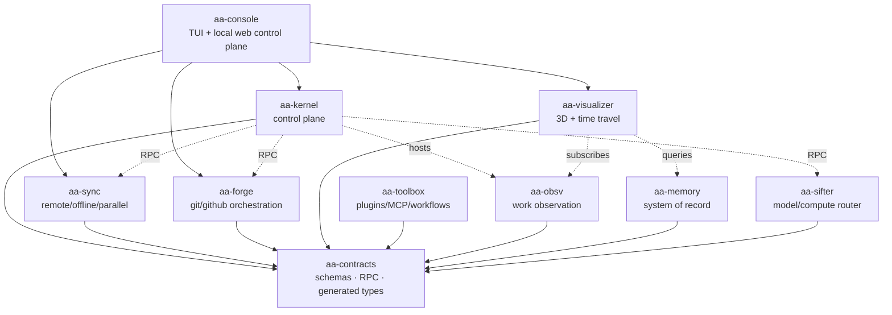
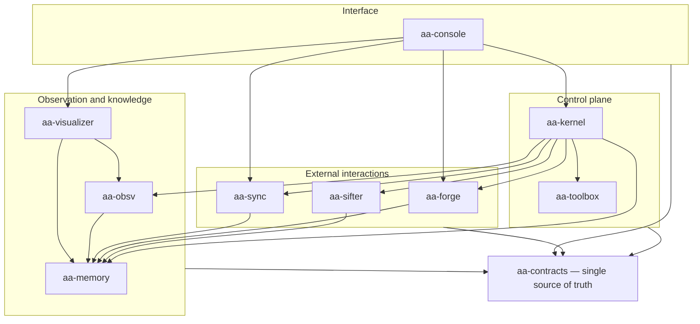
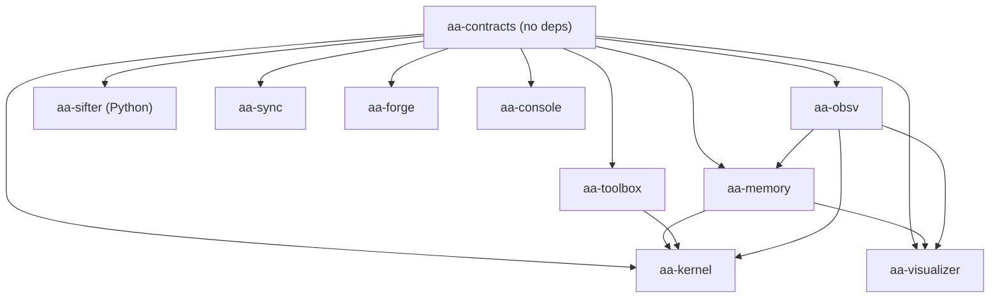
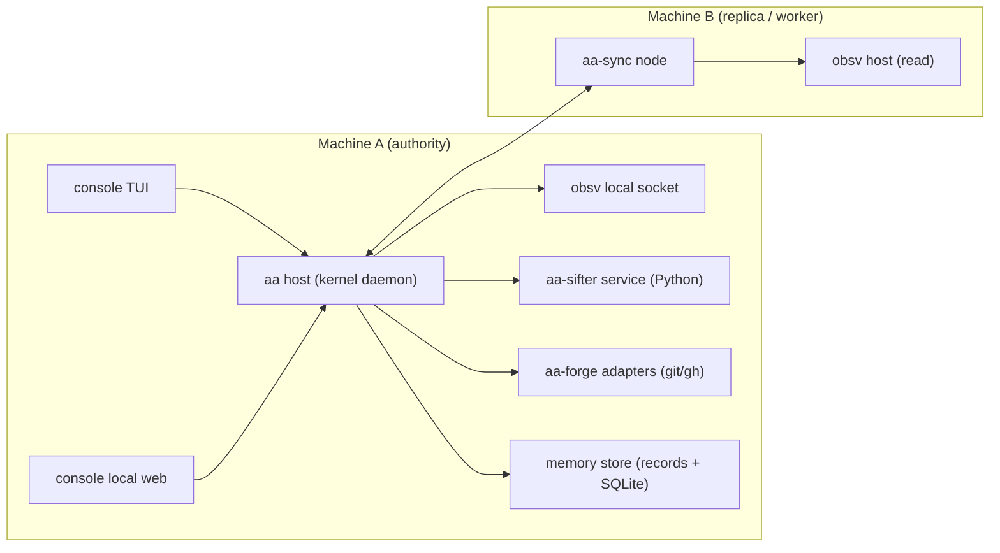
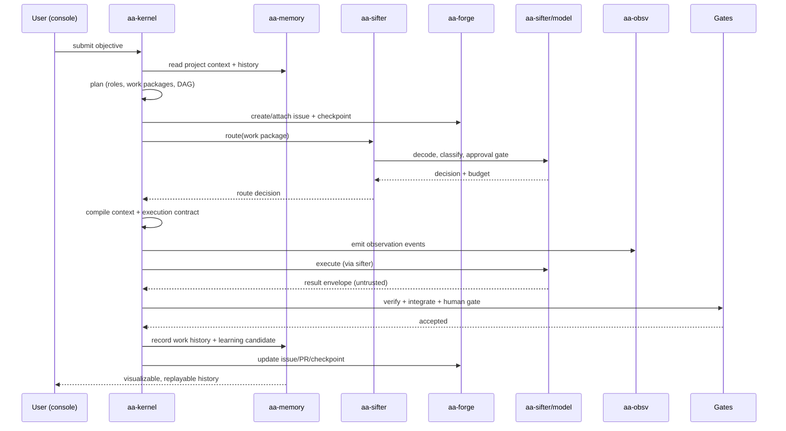
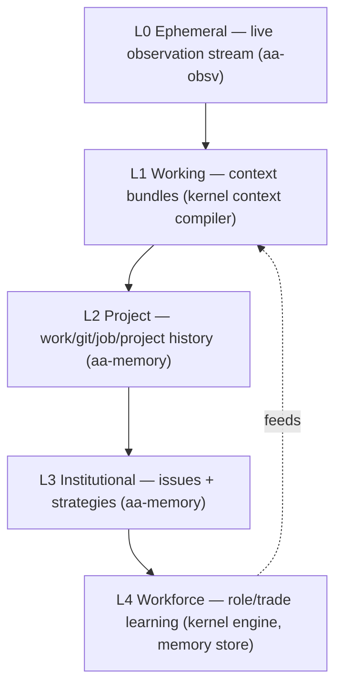

# aa — Optimized Architecture & End-to-End Plan

> This document is the canonical architecture for **aa**, the end-to-end agentic terminal. It describes the target system (visual and written), the reasoning behind every architectural decision, the tooling required, the testing strategy, and the high-level phase plan. Phase-level detail lives under [`docs/phases/`](../phases/README.md).
>
> **Migration note.** This repository is a clean import of the **aa** project from an earlier repository. The architecture is unchanged. The `ph0`–`ph3` commit history was re-created during the migration so that each phase lands as a reviewed pull request gated by CI; treat the history as a migration record, not the original development chronology.

## Table of contents

1. [Overview](#1-overview)
2. [Vision, principles, and non-goals](#2-vision-principles-and-non-goals)
3. [Current state and convergence](#3-current-state-and-convergence)
4. [Target architecture](#4-target-architecture)
5. [Module specifications](#5-module-specifications)
6. [Contracts and inter-module communication](#6-contracts-and-inter-module-communication)
7. [Identity, security, and privacy](#7-identity-security-and-privacy)
8. [Event, state, and memory model](#8-event-state-and-memory-model)
9. [Tooling, plugins/MCP, and configurable workflows](#9-tooling-pluginsmcp-and-configurable-workflows)
10. [Testing strategy](#10-testing-strategy)
11. [End-to-end phase plan](#11-end-to-end-phase-plan)
12. [Architectural decisions](#12-architectural-decisions)
13. [Migration strategy](#13-migration-strategy)
14. [Risks and open questions](#14-risks-and-open-questions)

---

## 1. Overview

**aa** is a local-first platform for observing, planning, executing, verifying, and continuously learning from software engineering work performed by humans and AI agents across one or many machines. It is an "operating system for an AI engineering workforce": the model is a worker, the platform is the organization.

The system is built from ten independently versioned modules joined by a single versioned contract layer. A deterministic control plane owns state and coordination. Models are reached only through a router. Every unit of work is observable, replayable, attributable, and promotable into institutional memory.

---

## 2. Vision, principles, and non-goals

### 2.1 Principles

1. **Deterministic coordination, probabilistic reasoning.** The platform owns state, mechanics, permissions, and scheduling. Models supply judgment inside bounded contracts.
2. **The model is a worker; the platform is the organization.** No model is the source of truth.
3. **Artifacts are the interface.** Work is handed off and verified through typed artifacts, not conversation.
4. **Independent verification is intentional.** Builders do not certify their own work.
5. **Responsibility before capability.** Durable roles define authority; capabilities execute within it.
6. **Use the smallest necessary organization.** Scale the workforce to risk.
7. **Evidence-based promotion.** Only validated work becomes memory; only gated features become active.
8. **Preserve only validated knowledge.** History is durable; drafts are not.
9. **Provider and machine independence.** Roles, work packages, and memory outlive any model or host.
10. **Security is a boundary, not a prompt.** Enforce mechanically wherever possible.

### 2.2 Non-goals (v1)

- No multi-writer or two-way canonical history; replicas observe but never gain authority.
- No automatic merge, deploy, secret access, or arbitrary remote shell.
- No learned routing, embeddings, predictions, or crew recommendation until their evidence gates pass.
- No raw prompt, source, credential, or terminal capture by default.
- No distributed execution authority until an explicit architecture decision supersedes single-authority.

---

## 3. Current state and convergence

Seven existing work areas converge into the ten target modules. The table below is the authority for what is reused, moved, or retired.

| Existing area | What it is | Destination |
|---|---|---|
| `file transfer app` (Go `syncgate`) | Sync MVP plus a complete but disabled kernel and half a memory system | `sync` (transfer/pairing/identity) + `kernel` (orchestration/scheduler/execution) + `memory` (records/projections) + `console`/`visualizer` (API/browser) |
| `agent-action-visualizer` | Go + Wails + React/Three 3D time-travel app with a duplicated observation protocol | `visualizer`, stripping protocol/IPC/event-store into `obsv` |
| `aa-obsv-module` | Product-neutral work-observation library | `obsv` |
| `compute-sifter` | Python `sifter`: classify → gate → route → execute → verify → escalate | `sifter` |
| `aasync-swe-suite` | Role/organization/orchestration specification | design input to `kernel` |
| `lightweight-github-os` + `general project md templates` | Process, documentation, and GitHub workflow methodology | this `docs/github-os/` tree (canonical) |
| `.local-planning/*` | Mixed implemented-stage logs and aspirational workforce plans | input to `kernel`, `memory`, `sync` |

### 3.1 Blurred concerns to resolve

| Problem | Resolution |
|---|---|
| Task/DAG modeled four ways (`project`, `orchestration`, `taskspec`, `workhistory`) | One task/work-package model in `contracts` |
| Telemetry duplicated (`telemetry`, `insights`, `desktop/lifecycle_telemetry`) | Operational telemetry in `kernel`; canonical history in `memory` |
| `desktop` mega-package re-implements orchestration | Split across `sync`, `kernel`, `console`, `visualizer` |
| Three event vocabularies, three memory hierarchies | One event taxonomy and one memory hierarchy in `contracts` |
| AAV and `obsv` protocol duplication with incompatible stripping | Resolved (`ISS-OBSV-2`): AAV adopts `obsv`; the visualizer defines no protocol, transport, or event-store and normalizes metadata through one explicit compatibility profile |
| No forge, plugin/MCP, or unified interface | New `forge`, `toolbox`, `console` modules |

### 3.2 Missing capabilities and their homes

| Capability | Module |
|---|---|
| Job learning | `kernel` (engine) + `memory` (promotion/store) |
| Strategy repository | `memory` |
| Issue repository | `memory` |
| GitHub orchestration: projects, issues, PRs, checkpoints, releases | `forge` |
| Optimization loop | `kernel` + `memory` |
| Interface that ties everything together | `console` |
| Tools/plugins/MCP and workflow configuration | `toolbox` |

---

## 4. Target architecture

### 4.1 Module map

### 4.2 Layering and dependency rules

Rules (enforced by architecture tests in each module):

1. `contracts` depends on nothing and may be imported by everything.
2. A module may import only **downward** in the diagram; no cycles.
3. `kernel` never imports `sync`, `forge`, or `sifter` code — it calls them over RPC.
4. `visualizer` never imports `kernel`.
5. `console` imports `contracts` only and talks to modules through the control-plane API.
6. Cross-module data structures exist only in `contracts`.

### 4.3 Runtime and deployment view

- The **host** is the kernel daemon. It owns the store, the scheduler, the observation journal, and the control-plane API.
- **aa-sifter** runs as a local sidecar process reached over RPC; it is the only Python module.
- **aa-sync** establishes paired, authenticated links between machines and moves work packages, artifacts, and offline changes.
- Exactly one machine holds execution **authority** for a project in v1. Others are read-only replicas and workers.

### 4.4 Primary end-to-end flow

### 4.5 Memory and event layering

Each layer has a different authority, retention, and promotion rule. Only `aa-memory` is canonical and permanent.

---

## 5. Module specifications

Each module lists: purpose · owns · must not · interfaces · language · reused assets · remaining work.

### 5.1 aa-contracts

- **Purpose:** the single source of truth for every cross-module object and wire protocol.
- **Owns:** JSON Schema (event v1, task/work-package/DAG, execution contract, result envelope, telemetry, project records, memory objects, issue/strategy records, route request/response, tool/MCP manifest, workflow definition); RPC/transport spec; generated Go, TypeScript, and Python bindings; conformance suite; versioning and compatibility policy; control-plane OpenAPI.
- **Must not:** contain business logic.
- **Interfaces:** generated packages + schemas.
- **Language:** language-neutral schemas; generated bindings.
- **Remaining work:** define v1 schemas, generators, conformance tests.

### 5.2 aa-obsv (work observation)

- **Purpose:** product-neutral observation of work events.
- **Owns:** protocol v1, durable projection, bounded failure-open emitter, local transport with attach-or-own, journal with replay/subscribe/retention, deterministic work reports, Codex `exec` translator.
- **Must not:** call models, own graph state, own project history, or require a runtime.
- **Interfaces:** `Ensure/Runtime`, `Send`, `Replay`, `Subscribe`; transport methods `hello/append/replay/subscribe`.
- **Language:** Go (library + local service).
- **Reused assets:** the entire `aa-obsv-module`.
- **Remaining work:** kernel orchestrator wiring (an `obsv`-backed sink) and the host socket under `ISS-OBSV-1`. The visualizer profile keys `secondary_paths`/`access_sequence` are allowlisted and normalized by `visualizer/compat` (`ISS-OBSV-2`).

### 5.3 aa-kernel (control plane)

- **Purpose:** deterministic coordination of all work.
- **Owns:** obsv host; planning (task aggregate, DAG, readiness); role/trade/worker registry and role selection; scheduler/leases/assignment state machine; context compiler; execution contracts, permissions, budgets; runtime contracts and adapters; workspace/worktree manager; compute-node registry; result intake; integration and human gates; operational telemetry; job-learning engine; control-plane API.
- **Must not:** own transfer, own canonical history, call models directly, or expose a remote shell.
- **Interfaces:** control-plane API, RPC to `sifter`/`sync`/`forge`, `obsv` host, memory query.
- **Language:** Go.
- **Reused assets:** `orchestration`, `scheduler`, `taskspec`, `registry`, `contextcompiler`, `executioncontract`, `resultintake`, `integrationgate`, `workspace`, `runtimecontract`, `codexruntime`, `computenode`, `dispatchbinding`, orchestration halves of `desktop`/`api`.
- **Remaining work:** role selection, job-learning engine, de-blur taskspec/orchestration, extract from syncgate, enforce boundaries.

### 5.4 aa-memory (system of record)

- **Purpose:** canonical, portable, rebuildable institutional knowledge.
- **Owns:** canonical records and portable `.aa-project/` layout; rebuildable SQLite projections; work/git/job/project histories; **issue repository**; **strategy repository**; memory hierarchy with lifecycle and deterministic promotion; provenance; relational/event/graph indexes (vector optional); deterministic query API.
- **Must not:** execute work or call models.
- **Interfaces:** record read/write, query API, projection rebuild.
- **Language:** Go.
- **Reused assets:** `project`, `projector`, `workhistory`, `insights`, telemetry storage, `projectmigration`, obsv work reports.
- **Remaining work:** issue/strategy repos, promotion engine, git-history reader, query API.

### 5.5 aa-sync

- **Purpose:** move files and work between machines, securely and resiliently.
- **Owns:** paired mutual-TLS transport; resumable verified chunked transfer; one-way revision sync; offline change queue and reconciliation; work-package and artifact distribution; parallelization transport.
- **Must not:** become a remote shell or gain execution authority.
- **Interfaces:** transport protocol; sync API; kernel RPC.
- **Language:** Go.
- **Reused assets:** `sync`, `transfer`, `transport/tcp`, `pairing`, `identity`, `filesystem`, `core`, `privatetunnel`, sync half of `desktop`/`daemon`.
- **Remaining work:** offline queue, work-package distribution, multi-machine parallel coordination, discovery/relay decision.

### 5.6 aa-sifter

- **Purpose:** decode a prompt and route it to the appropriate local or cloud model under budget and approval.
- **Owns:** classification, human approval gate, preflight, policy routing, budgets, escalation, provider abstraction (Ollama/OpenAI-compatible), verification, context compression/handoff, compute orchestration across local/cloud.
- **Must not:** hold project state or perform orchestration.
- **Interfaces:** RPC `route(request) -> decision`, `generate(messages, tier) -> result`.
- **Language:** Python.
- **Reused assets:** the entire `compute-sifter`, renamed.
- **Remaining work:** wire decomposition/executor, redact on all cloud paths, transmit token limits, budget waiver and rule grants, remove brand leakage, expose stable RPC.

### 5.7 aa-forge

- **Purpose:** orchestrate git and GitHub work as first-class objects.
- **Owns:** forge abstraction (GitHub, local git, fake); repo/project creation; milestones and phase tracking; issues; branches; child and phase PRs; **checkpoints**; audits; releases/tags; template rendering; forge↔memory sync.
- **Must not:** merge without a human gate or store secrets.
- **Interfaces:** forge API, template engine, kernel RPC, memory sync.
- **Language:** Go (adapters to `git` and `gh`).
- **Reused assets:** `lightweight-github-os` templates and workflow.
- **Remaining work:** all of it (new module).

### 5.8 aa-toolbox

- **Purpose:** make the platform extensible without core changes.
- **Owns:** tool/plugin/MCP registry and manifests; capability and permission grants; sandboxing; provider-agnostic invocation RPC; workflow definition schema, compiler, and runtime; policy engine.
- **Must not:** grant capabilities implicitly.
- **Interfaces:** tool manifest, invocation RPC, workflow runtime.
- **Language:** Go (+ MCP host).
- **Remaining work:** all of it (new module).

### 5.9 aa-visualizer

- **Purpose:** make work tangible and debuggable through time travel and 3D visualization.
- **Owns:** 3D graph, replay, session trails, live bridge, memory session browsing.
- **Must not:** own the observation protocol or canonical history.
- **Interfaces:** `obsv` subscribe/replay behind `visualizer/source`; memory queries.
- **Language:** Go core + Wails + React/Three.
- **Reused assets:** `agent-action-visualizer` graph/session/diff/replay/UI.
- **Adopted (`ISS-OBSV-2`):** `obsv` `Replay`/`Subscribe` behind one `source` seam and one `adapter` mapping; the explicit `compat` profile normalizes `secondary_paths`/`access_sequence`; session-state projection, identity mapping, deterministic layout, replay cursor, live bridge, and retention are delivered under `ph8-visualizer`; a boundary guard enforces the single observation vocabulary.
- **Remaining work:** the Wails + React/Three UI surface and the kernel-host socket.

### 5.10 aa-console

- **Purpose:** tie the platform together for humans.
- **Owns:** CLI/TUI and local web control plane behind pluggable **surfaces**; workflow configuration; plugin/MCP management; memory/issue/strategy/visualizer browsing; multi-machine status; approval and gate UI.
- **Must not:** couple to module internals; it uses only the control-plane API and `contracts`.
- **Interfaces:** control-plane API client, pluggable surface interface.
- **Language:** Go (TUI + local web); a desktop surface can be added later.
- **Remaining work:** all of it (new module, built last).

---

## 6. Contracts and inter-module communication

- **Single schema source.** All cross-module objects are defined once in `contracts` and code-generated for Go, TypeScript, and Python. No module defines its own cross-module DTOs.
- **RPC, not imports.** Cross-module calls use a versioned JSON-RPC protocol over an authenticated local socket (named pipe on Windows, Unix domain socket elsewhere). Messages carry schema version, request id, and identity.
- **Versioning.** Schemas are versioned `v1`, `v2`, …; additive changes are backward compatible; breaking changes require a major bump and a migration plan. Compatibility is checked in the conformance suite.
- **Conformance suite.** One test suite validates every generator and every module against the schemas.
- **Control-plane API.** The console and visualizer use a versioned HTTP/JSON control-plane API (OpenAPI-documented). Write operations are idempotent and auditable.

---

## 7. Identity, security, and privacy

- **Identity:** Ed25519 device keys and fingerprints; signed pairing invitations; OS credential store for secrets.
- **Transport:** paired mutual TLS between machines; least-privilege grants; revocation and audit.
- **Execution boundary:** execution is a separate, capability-scoped, opt-in subsystem. The shipped default is disabled.
- **Privacy:** metadata-only observation by default; no raw prompt, source, credential, or terminal capture; redaction is applied before **any** cloud handoff.
- **Least privilege:** execution contracts intersect requested and permitted capabilities; worktrees are isolated; results are untrusted until accepted.
- **Integrity:** directory records are canonical and hash-verified; the SQLite projection is rebuildable and never authoritative.

---

## 8. Event, state, and memory model

- **One event taxonomy** (defined in `contracts`) with `WORK_PACKAGE_*` and `EXECUTION_*` families; no parallel `AGENT_*` state.
- **One state registry** covering project, work package, assignment, readiness, issue, and sprint states, each with an explicit owner.
- **Event sourcing:** state is derived from ordered, deduplicated events; ordering is resolved from record fields, not wall clock.
- **Memory hierarchy:** `Session → Task/Workstream → Project → Role/Trade → Workforce`, with lifecycle `EPHEMERAL → CANDIDATE → VALIDATED → ACTIVE → SUPERSEDED → ARCHIVED` and deterministic promotion rules.
- **Indexes are not truth:** relational, event, graph, and optional vector indexes are rebuildable views. Canonical records remain the source of truth.

---

## 9. Tooling, plugins/MCP, and configurable workflows

- **Tool and plugin registry.** Every tool (built-in, plugin, or MCP server) declares a manifest: identity, version, capabilities, permissions, inputs/outputs, and sandbox requirements.
- **Capability grants.** Invocation requires a grant that intersects the tool's declared capabilities with the caller's execution contract. Denials are explicit and audited.
- **MCP support.** MCP servers are first-class providers behind the same registry and permission model; adding one requires no core change.
- **Workflows as data.** A workflow is a declarative document (steps, roles, gates, retries, budgets) compiled by `toolbox` and executed by `kernel`. Workflows are versioned, resumable, and testable.
- **Required tooling:** see [Section 12.2](#122-tooling-required).

---

## 10. Testing strategy

Testing is continuous and layered. Every module owns its pyramid; `contracts` owns cross-module conformance; phases add end-to-end coverage.

| Layer | Scope | Examples |
|---|---|---|
| Unit | Pure logic and types | classifiers, DAG readiness, path safety, promotion rules |
| Contract | Schemas, generators, providers, APIs | schema conformance, provider request shape, OpenAPI routes |
| Integration | Module internals with fakes | routing + budget + gate, projection rebuild |
| Boundary | Layering and import rules | no `kernel`→`sync` import, no `contracts`→module import |
| Property/Fuzz | Parsers and validators | path normalization, envelope decoding, policy intersection |
| Golden/Determinism | Stable outputs | context digests, rebuild equivalence, replay ordering |
| Security/Privacy | Boundaries and redaction | redaction on every cloud path, permission denial, secret non-leak |
| Chaos/Recovery | Failure handling | crash mid-transfer, DB quarantine, lease expiry |
| E2E | Real workflows | two/three-machine sync, supervised run, forge phase lifecycle, plugin add |
| Live smoke | Optional, paid/network | one provider connectivity check, gated by env |
| UI | Renderer and console | replay + console workflows via Playwright |

Rules:

1. Default suites make **zero** network calls; live tests are explicitly marked and opt-in.
2. Learned or optimization features cannot enable until their **evidence gate** passes; deterministic fallbacks always remain.
3. Boundary tests are named `architecture_test.*` and run in CI.
4. Phase exit criteria include the test plan written in `plan.md`.

---

## 11. End-to-end phase plan

Each phase is a GitHub milestone with a tracking issue, a phase branch equal to its folder name, a Draft phase PR, child issues/PRs, a `plan.md` + `plan.uml` at the start, and a `summary.md` + `summary.uml` at the end. Stop points are slice boundaries.

### Phase 0 — `ph0-scaffold` — Foundation & Governance
- **Goal:** a repository and process that can carry the project.
- **Deliverables:** monorepo layout and `go.work`; this docs tree; branch/commit/phase conventions; ADR log; terminology and state registry; CI matrix; boundary-test harness; security/license policy.
- **Exit:** CI green on the skeleton; boundary harness present; docs indexes and templates installed.
- **Testing:** CI smoke, docs-link check, boundary harness self-test.

### Phase 1 — `ph1-contracts` — Contract spine
- **Goal:** one schema source for everything that crosses a module.
- **Deliverables:** schema v1 for all cross-module objects; RPC spec; generated Go/TS/Python bindings; conformance suite; versioning policy; control-plane OpenAPI.
- **Exit:** all modules compile against contracts; conformance green; no ad-hoc cross-module DTOs.
- **Testing:** contract, golden, fuzz on decoders.

### Phase 2 — `ph2-memory` — System of record
- **Goal:** canonical, portable, rebuildable knowledge.
- **Deliverables:** records + portable layout; projections/rebuild; work/git/job/project histories; issue repo; strategy repo; hierarchy + lifecycle/promotion; provenance/retention; query API; migration from syncgate.
- **Exit:** rebuild-equivalence, idempotent ingestion, provenance, retention tests pass.
- **Testing:** golden rebuild equivalence, integration, promotion rules, boundary.

### Phase 3 — `ph3-kernel` — Control plane
- **Goal:** a real, supervised, gated execution loop.
- **Deliverables:** obsv host; planning/DAG/readiness; role/trade registry + selection; scheduler/leases/assignment; context compiler; execution contracts/budgets; runtime adapters; workspace/worktrees; result intake; integration + human gates; telemetry; job-learning capture; control-plane API; single-node pilot.
- **Exit:** supervised end-to-end run on a real repo; execution disabled by default; boundaries enforced.
- **Testing:** integration with fakes, boundary, chaos (lease expiry), e2e supervised run.

### Phase 4 — `ph4-sifter` — Model/compute router
- **Goal:** all model usage governed and routed.
- **Deliverables:** stable RPC; decomposition/executor wiring; redaction on all cloud paths; token limits; budget waiver and rule grants; hardware/recommender; traces to memory.
- **Exit:** kernel routes local/cloud/hybrid per policy; approval honored; contract + live smoke pass.
- **Testing:** contract (providers), integration (routing/budget/gate), security (redaction), live smoke.

### Phase 5 — `ph5-forge` — Git/GitHub orchestration
- **Goal:** the whole engineering lifecycle is automated and auditable.
- **Deliverables:** forge abstraction; project/repo creation; milestones/tracking; issues; branches; child/phase PRs; checkpoints; audits; releases/tags; templates; forge↔memory sync.
- **Exit:** full phase lifecycle automated with audit trail; deterministic fake-forge tests.
- **Testing:** fake-forge determinism, idempotency, rate-limit handling, e2e lifecycle.

### Phase 6 — `ph6-sync` — Remote/offline/parallel
- **Goal:** move work across machines safely and resiliently.
- **Deliverables:** harden sync/transfer; work-package + artifact distribution; offline queue/reconciliation; multi-machine parallel coordination; resumable/partial transfer; privacy; discovery/relay decision.
- **Exit:** 2–3 machine acceptance; outage/reconnect; offline editing; parallel dispatch.
- **Testing:** multi-daemon e2e, chaos, security.

### Phase 7 — `ph7-toolbox` — Plugins/MCP/workflows
- **Goal:** extend and configure without core changes.
- **Deliverables:** tool manifest; plugin/MCP host; capability/permission/sandbox model; invocation RPC; workflow schema/compiler/runtime; policy engine.
- **Exit:** add a plugin/MCP with no core change; permission-denial tests; workflow resume.
- **Testing:** contract, security, integration, recovery.

### Phase 8 — `ph8-visualizer` — Visualization
- **Goal:** work is tangible, replayable, debuggable.
- **Deliverables:** adopt `obsv`; compatibility profile; session-state projection; identity mapping; work-report vs geometry reconciliation; retention; 3D/time-travel polish; memory browsing.
- **Exit:** live + replay + cross-session work; large-graph performance budget; UI e2e.
- **Testing:** golden replay, performance, UI e2e.

### Phase 9 — `ph9-joblearn` — Learning & optimization
- **Goal:** the platform improves from its own history, safely.
- **Deliverables:** similarity, retrospective generator, outcome estimator, crew/trade recommender, conflict engine, evidence-gated learned routing, strategy extraction/promotion, orchestration scoring, dashboards.
- **Exit:** each feature enables only after its evidence gate passes; backtests; deterministic fallbacks retained.
- **Testing:** evidence gates, backtesting, golden fallbacks.

### Phase 10 — `ph10-console` — Unified interface
- **Goal:** one entry point drives the whole workflow.
- **Deliverables:** CLI/TUI; local web control plane; workflow configuration; plugin management; memory/issue/strategy/visualizer browsing; multi-machine status; approvals/gates.
- **Exit:** end-to-end workflow usable from one surface; UI e2e; desktop surface addable.
- **Testing:** UI e2e, integration, accessibility/usability.

### Phase 11 — `ph11-release` — Hardening & release
- **Goal:** a releasable v1.
- **Deliverables:** threat model and security review; performance/load; chaos/recovery; packaging/installers; release gates and versioning; docs completion; repository audits; migration guides.
- **Exit:** release checklist complete; audits pass.
- **Testing:** full matrix, security review, chaos, release-gate automation.

---

## 12. Architectural decisions

Each decision states the choice and the reasoning. These are the cross-cutting decisions; phase-specific decisions are recorded in each phase's `plan.md`.

### 12.1 Core decisions

| # | Decision | Reasoning |
|---|---|---|
| D1 | **Monorepo** with independently versioned modules | Atomic contract changes, one CI, and enforceable boundaries beat polyrepo version skew at this scale |
| D2 | **`aa-contracts` as the only schema source**, with generated bindings | Removes four task models and three event vocabularies; guarantees modules agree |
| D3 | **Contract-first RPC over authenticated local sockets**, not cross-imports | Modules can be rewritten or scaled independently; keeps Python sifter decoupled |
| D4 | Go for sync/kernel/memory/obsv/forge/toolbox/visualizer core; **Python for sifter**; TS/React for UI | Leverages existing investments, concurrency/performance, and ML ecosystem |
| D5 | **Strict layering enforced by architecture tests** | Prevents the concern-blur that exists today from returning |
| D6 | **Single-authority, single-node execution** in v1; read-only replicas | Avoids split-brain and multi-writer corruption; matches the proven security posture |
| D7 | **Directory records canonical; SQLite projection rebuildable** | Portability, git-friendliness, determinism, and recoverability |
| D8 | Separate **operational telemetry / work history / memory** | Different authority, retention, and truth semantics; removes duplication |
| D9 | **Hierarchical memory with explicit lifecycle and deterministic promotion** | Evidence-based learning that resists knowledge poisoning |
| D10 | Extract work observation as **`aa-obsv`**, hosted by kernel, consumed by visualizer | One observation protocol; removes AAV duplication; stays product-neutral |
| D11 | **Role = durable responsibility; trade = capability; worker = instantiation; model = backend** | Provider/model independence and stable identity |
| D12 | **Deterministic role selection** from the registry; LLM proposes only within bounds | Reproducibility, safety, and testability |
| D13 | **Model/compute routing only via `aa-sifter`** behind an interface | One enforcement point for budgets, approval, and redaction |
| D14 | **Execution is opt-in, capability-scoped, and separate** | Prevents sync from becoming a hidden remote shell |
| D15 | **`aa-forge` as a first-class module** with forge abstraction and a fake | Testable without network; decouples GitHub lifecycle from kernel/memory |
| D16 | **`aa-toolbox` as a first-class module** for tools/plugins/MCP | Extensibility without core changes; explicit capability grants |
| D17 | **Workflows as data**, compiled and executed | Configurable processes without code changes |
| D18 | **Human approval gates first-class and runtime-enforced** | Safety-critical changes require consent, mechanically |
| D19 | **Layered testing plus evidence gates before learned features** | Correctness and safe enablement |
| D20 | **Event-sourced, deterministic control plane; model never source of truth** | Reconstructability and auditability |
| D21 | **Metadata-only observation; redact before cloud; OS credential store; least privilege** | Privacy and security by default |
| D22 | **`aa-console` last and thin**, built on pluggable surfaces | Avoids coupling UX to volatile internals; a desktop surface can be added later |

### 12.2 Tooling required

| Category | Tools |
|---|---|
| Core toolchain | Go 1.26, Node 20+, Python 3.12, `go.work`, Wails v2, React/Three/R3F, `modernc.org/sqlite`, Git, GitHub CLI (`gh`), Make/Task |
| Contracts | JSON Schema validator, OpenAPI generator, Spectral, optional `buf` (protobuf), schema-compatibility checker |
| Lint/type | `golangci-lint`, `ruff`, `mypy`, ESLint, Prettier |
| Tests | `go test` (+race, fuzz), Vitest, pytest (unit/integration/contract/smoke/live), Playwright |
| Runtime/compute | Ollama, OpenAI-compatible and DeepSeek clients, `nvidia-smi`/hardware probes, optional Docker, `sccache` |
| Security/quality | `gitleaks`, `semgrep`, dependency/vulnerability scanners, OS credential stores, code signing, Inno Setup/NSIS |
| Observability | OpenTelemetry, pprof, structured logs, optional Prometheus/Grafana |
| Plugins/MCP | MCP SDK/host, OS sandbox primitives (job objects/AppContainer, seccomp) |
| Process | GitHub Projects, milestones, issues, PRs; docs link checker |

---

## 13. Migration strategy

1. **Do not rewrite first.** Copy existing source into module directories, add `go.work`/packaging, and delete duplicates only after replacements pass tests.
2. **Contracts first.** Extract cross-module types into `contracts` before moving behavior, so modules can be cut over incrementally.
3. **Memory and obsv before kernel.** The kernel needs a system of record and an observation host; build those first.
4. **Kernel extraction.** Move orchestration/scheduler/execution out of syncgate, deleting the `desktop` mega-package's duplicated orchestration as boundaries are proven.
5. **Sifter behind RPC.** Wrap `compute-sifter` as a service and route all model access through it.
6. **Forge, then toolbox, then visualizer, then console.** External automation and extensibility before interface.
7. **Retire:** stale `doc.go` "will own" notes, duplicate `[G]` vs `[LG]` docs (`docs/github-os/` is canonical), and overlapping phase/slice/stage numbering.
8. **Each move is a phase slice with its own commit and validation**, not a single large refactor.

---

## 14. Risks and open questions

| Risk / question | Mitigation / decision needed |
|---|---|
| Extraction could destabilize the working sync MVP | Keep sync as a separate, first-class module; never entangle it with kernel execution |
| Contract churn while modules are being extracted | Version schemas early; freeze v1 before kernel work; conformance suite blocks regressions |
| Python/Go/RPC boundary latency and error handling | Define deadlines, retries, and idempotency in the RPC contract; test with fakes |
| AAV `obsv` compatibility (`secondary_paths`, `access_sequence`) | Resolved (`ISS-OBSV-2`): the explicit `visualizer/compat` profile normalizes them over the shared `obsv` allowlist; no AAV fork |
| Scope creep across ten modules | `ph0` governance, strict phase exit criteria, and evidence gates |
| Learned features could mislead | Evidence gates with deterministic fallbacks; human approval stays authoritative |
| Multi-machine parallelization without multi-writer history | Single authority; replicas read-only; revisit with a dedicated ADR |
| Interface built too early | `aa-console` is last; surfaces are pluggable; control-plane API is stable first |

## Glossary

See [../reference/terminology.md](../reference/terminology.md).
